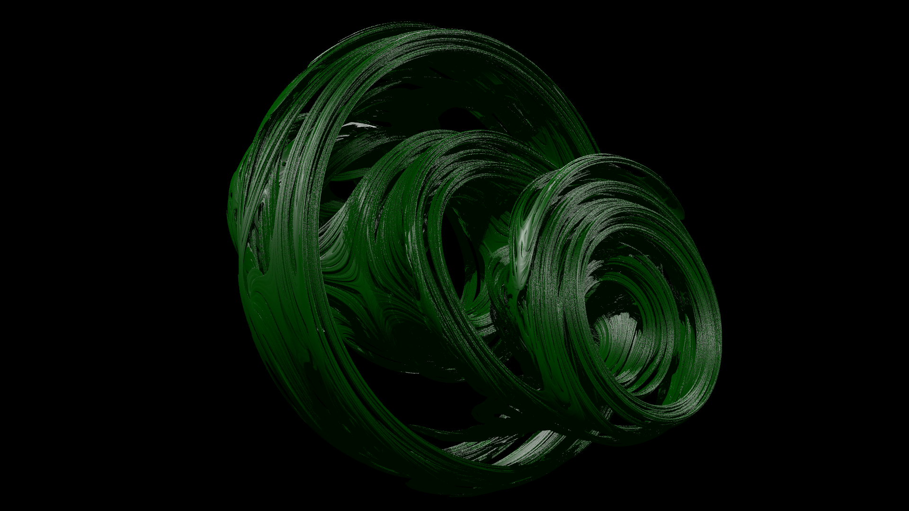
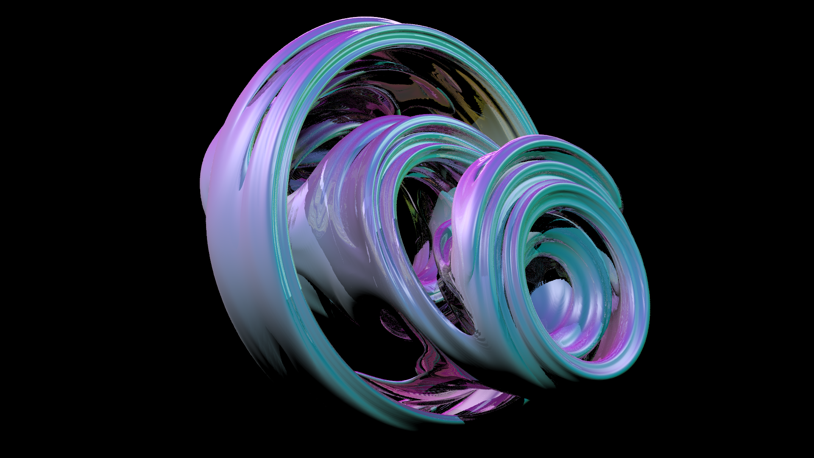

# Extension: JuliaSet


### Author: Matej Kopcil

### Category: Solid

### Namespace: MatejKopcil

### Class name: JuliaSet : DefaultSceneNode, ISolid

### ITimeDependent: No

### Source file: JuliaSet.cs

This extensions implements 3D slice of quaternion Julia set ([Julia set]("https://en.wikipedia.org/wiki/Julia_set#:~:text=Equivalent%20descriptions%20of%20the%20Julia%20set), [Quaternion Julia set](http://paulbourke.net/fractals/quatjulia/), [Ray Tracing Deterministic 3-D Fractals](https://www.cs.drexel.edu/~david/Classes/Papers/rtqjs.pdf)). User gives quaternion C as a parameter of the 3d slice.


User is able to define a couple of parameters:

* **BoundingSphereRadius** - Radius of sphere in which Julia set is intersected.   
    Default value: `3.0`.


* **EscapeRadius** - How far must quaternion Z escape while iterating to be counted as outside of the Julia set.  
  Default value: `3.5`.


* **MaxIterations** - Maximum number of iterations of quaternion Z.  
  Default value: `20`.


* **Epsilon** - How close point on ray needs to be to be counted as inside the Julia set.  
  Default value: `0.0001`.


* **EpsilonRelativeToDistance** - Should epsilon be used as absolute or should it be use relative to the distance from ray origin.  
  Default value: `true`.


* **Delta** - Shift value for intersection point to calculate the gradient, which is used to approximate normal vector.  
  Default value: `0.0000001`.


* **MaxIntersections** - Maximal number of Intersections of one ray.  
  Default value: `128`.

----

### Category: Texture

### Namespace: MatejKopcil

### Class name: NormalTexture : ITexture

### ITimeDependent: No

### Source file: JuliaSet.cs

Texture which gives color based on normal vector

## Example

From a scene/animation definition script
```
using MatejKopcil;

...

JuliaSet js = new JuliaSet(-0.8, 0.2, 0, 0) { Epsilon = 0.001, MaxIterations = 20 };
```

### Sample scene script: JuliaSetScene.cs

## Images


